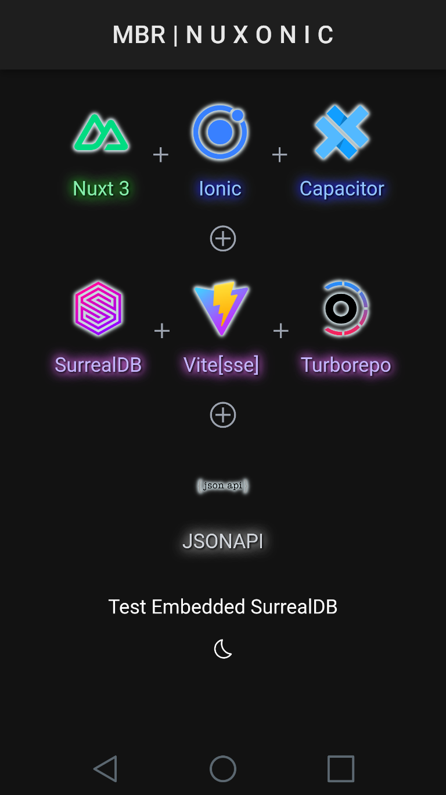

<div align="center">
  <a href="https://nuxonic.netlify.app/">
    
  </a>
</div>

# MBR | N̷ U̴ X̴̴ O̷ N̴ I̷ C̴̴

Mobile, PWA/Web using [Nuxt]/[Vue] and [Ionic], with embedded [SurrealDB].


## [Demo][nuxonic-demo]


## Features

  - [Vitesse flavored Nuxt] for pre-setup niceties like [UnoCSS] and [Pinia], where UnoCSS even seems to work nicely alongside Ionic's own CSS.

  - [Ionic] via [Nuxt/Ionic] incl. using its [Ionic Bright/Dark theming CSS].

  - Android and iOS using [Capacitor][capacitor-git].

  - Embedded instance of [SurrealDB]-[WASM][surrealdb-wasm] ([WebAssembly]) - a full fledged modern database server inside a mobile app (adds just ~5MB, no big deal).
  
  - [JSONAPI] within SurrealDB - still a "DODO" - a JSONAPI layer for SurrealDB, not in Rust itself (maybe later), just JS which SurrealDB supports natively, either within queries or embedded as stored functions.


## Usage/Commands

### Setup

  - Configure your `.env` from `.env.example`.

  - Install - *if not already done for root (`/`)*.
    ```sh
    > bun install
    ```


### Dev
  
  - Dev Server and Open Browser
    ```sh
    > bun run devo
    ```

  - Dev Server Bound to Hosts/Ports for Live Reload
    ```sh
    > bun run devl
    ```


### Capacitor

  - Capacitor Asset Generation    
    ```sh
    > bun run cag
    ```

  - Nuxt Generate and Capacitor Sync
    ```sh
    > bun run gcs
    ```

  - Capacitor Android Emulator
    ```sh
    > bun run cae
    ```

  - Capacitor Android Device
    ```sh
    > bun run cad
    ```

  - Capacitor Android Emulator Live
    ```sh
    > bun run cael
    ```

  - Capacitor Android Device Live
    ```sh
    > bun run cael
    ```


<!-- urls -->
[MBR-Demo-GitLab]: https://gitlab.com/mblackrittr/mbr-demo/
[MBR-Demo-GitHub]: https://github.com/mblackrittr/mbr-demo/
[MBR-Nuxonic-GitLab]: https://gitlab.com/mblackrittr/mbr-demo/tree/master/apps/nuxt-ionic/
[MBR-Nuxonic-GitHub]: https://github.com/mblackrittr/mbr-demo/tree/master/apps/nuxt-ionic/

[Nuxonic-Demo]: https://nuxonic.netlify.app/

[AntFu-ESLint-Config]: https://github.com/antfu/eslint-config/
[Capacitor]: https://capacitorjs.com/
[Capacitor-Git]: https://github.com/ionic-team/capacitor/
[Changesets]: https://github.com/changesets/changesets/
[Changeset-Conventional-Commits]: https://github.com/iamchathu/changeset-conventional-commits/
[Commitlint]: https://commitlint.js.org/
[Commitizen]: https://commitizen-tools.github.io/commitizen/
[Config-Conventional]: https://github.com/conventional-changelog/commitlint/tree/master/@commitlint/config-conventional/
[Config-PNPM-Scopes]: https://github.com/conventional-changelog/commitlint/tree/master/@commitlint/config-pnpm-scopes/
[Conventional Commits: A Better Way]: https://medium.com/neudesic-innovation/conventional-commits-a-better-way-78d6785c2e08
[Ionic]: https://ionicframework.com/
[Ionic Bright/Dark theming CSS]: https://ionicframework.com/docs/theming/dark-mode#combining-with-javascript
[JSONAPI]: https://jsonapi.org/
[Nuxt/Ionic]: https://ionic.nuxtjs.org/
[NCU - NPM-Check-Updates]: https://github.com/raineorshine/npm-check-updates/
[Nuxt]: https://nuxtjs.org/
[Nuxt/Ionic]: https://ionic.nuxtjs.org/
[Pinia]: https://pinia.vuejs.org/
[Sonar]: https://www.sonarsource.com/
[ESLint-Plugin-SonarJS]: https://github.com/SonarSource/eslint-plugin-sonarjs/
[Sheriff-ESLint-Config]: https://eslint-config-sheriff.dev
[SurrealDB]: https://surrealdb.com/
[SurrealDB-WASM]: https://github.com/surrealdb/surrealdb.wasm/
[Syncpack]: https://jamiemason.github.io/syncpack/
[Turborepo]: https://turbo.build/
[UnoCSS]: https://unocss.dev
[Vitesse flavored Nuxt]: https://github.com/antfu/vitesse-nuxt3/
[Vue]: https://vuejs.org/

[Bun]: https://bun.sh/
[PNPM]: https://pnpm.io/

[WebAssembly]: https://webassembly.org/
